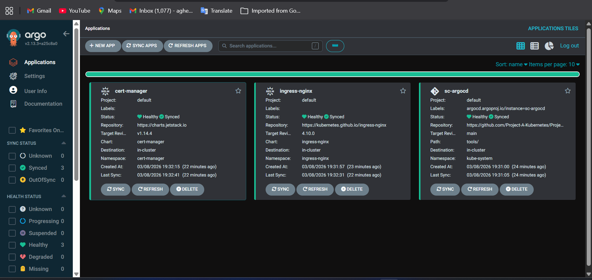

# Prometheus Stack Deployment with Argo CD
### Overview

This repository demonstrates the deployment of the Prometheus monitoring stack on a Kubernetes cluster using Helm and Argo CD. The setup includes GitOps-based management, persistent storage configuration, and automated application syncing.
## Simple Deployment diagram 

## Repository Structure
```
prometheus-stacks/
├── Readme.md
├── stacks/
│   ├── stack-argocd.yml   # Argo CD Application manifest
│   └── value.yml          # Helm chart values
└── storage/
    ├── argocd-watch.yml
    └── storageclass.yml
```

### Steps Completed
1. Argo CD Installation

    - Installed Argo CD via Terraform.
2. GitHub App Integration

    - Configured a GitHub App for Argo CD repository access.
    - Obtained GitHub App ID and Installation ID from the organization.
    - Added the repository to Argo CD using:
```
argocd repo add https://github.com/Project-A-KubernetesProject_A_Prometheus-stacks.git \
  --github-app-id APP_ID \
  --github-app-installation-id INSTALLATION_ID \
  --github-app-private-key-path PRIVATE_KEY_PATH
```
This connected my argocd repo server to my github repo (over HTTPS) as the only source of truth to the cluster 

3. Prometheus Helm Chart Configuration

    - Used the kube-prometheus-stack Helm chart from the Prometheus Community Helm repository.
    - Created value.yml with custom configuration (enabled grafana, alertmanager, storage settings, prometheus).
    - Committed value.yml to Git so Argo CD can reference it during deployment.

4. Persistent Storage Configuration

    - Configured StorageClass (gp3) for Prometheus persistent volumes.
    - Ensured PVs and PVCs are properly bound.
    - Resolved pod issues caused by PVs stuck in the Deleting state.

## How to run
After applying the terraform repository eks and other resources running then you apply this to the cluster the add this repo url to the "argocd repo" 
example :
```
argocd repo add https://prometheus-community.github.io/helm-charts --type helm 
# for the prometheus stacks and for the installation of storageclasss 
# clone the repo and create your github-app from settings/github-app
argocd repo add https://github.com/Project-A-KubernetesProject_A_Prometheus-stacks.git \
  --github-app-id APP_ID \
  --github-app-installation-id INSTALLATION_ID \
  --github-app-private-key-path PRIVATE_KEY_PATH
```